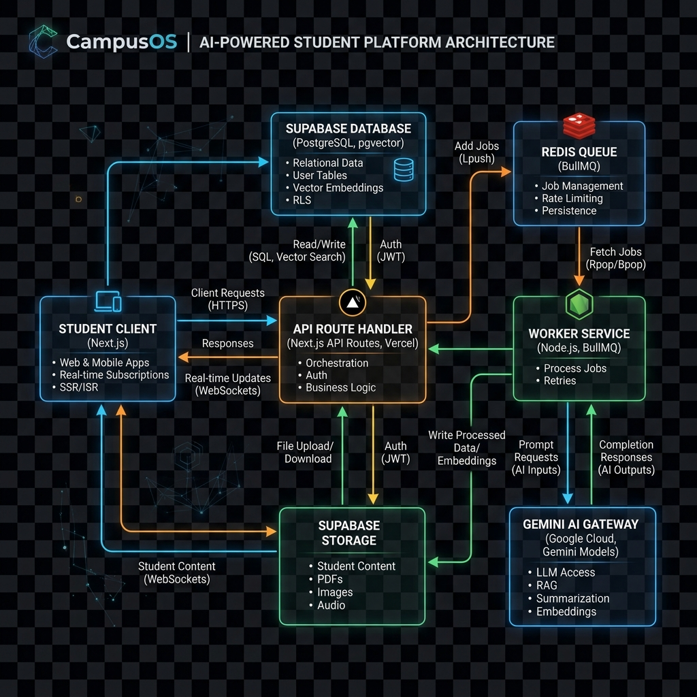

# CampusOS: The AI-Powered Student Command Center & Cognitive Twin

CampusOS is a comprehensive, AI-native academic workspace and cognitive assistant designed to centralize and personalize the college student experience. By replacing fragmented systems like disconnected note-taking apps, calendar utilities, spreadsheet trackers, and standalone flashcard platforms, CampusOS establishes a single unified cockpit that charts a student's cognitive learning journey.

At the core of CampusOS lies the **Digital Twin Memory System**, an interactive learning persona that models the student's strengths, weaknesses, study schedules, and exam readiness based on direct database actions. The entire application enforces a strict **data-grounded product rule**: there are zero hardcoded mock values, placeholder statistics, or simulated dashboards. If no data exists, the application intercepts the user journey with meaningful onboarding steps to get to know the student.

---

## 🚀 Key Features & Workspace Modules

### 1. Unified Student Dashboard (Main Hub)
The central launchpad of the system. Rather than rendering static analytics, the dashboard queries real database logs to calculate study hours, checklists, and resume status. When a new user logs in, the dashboard displays custom onboarding fallback cards prompts to guide their setup.


### 2. Academic Brain (Vector RAG & Knowledge Graph)
A central document repository supporting PDF, DOCX, PPTX, and TXT files.
* **Multimodal OCR Extraction**: Automatically extracts text, tables, checklists, and equations from scans or images using Gemini's multimodal parser.
* **Vector Vectorization**: Chunks document text and stores 768-dimension vectors inside Supabase PostgreSQL using `pgvector` accelerated by HNSW indices.
* **Knowledge Graph construction**: Parses materials to map academic vertices (`knowledge_nodes`) and relationship links (`knowledge_edges`) into an active knowledge graph.
* **Embedding Reuse Optimization**: Automatically hashes text segments (SHA-256) and queries the database first; if an embedding vector already exists, it is copied directly, saving API token costs.


### 3. Digital Twin Memory Console
Acts as the cognitive duplicate of the student.
* **Memory Profile**: Displays parameters such as preferred study hours, diagnosed focus minutes, repetition stamina scales, and strong/weak concepts maps.
* **Twin Monologue**: Generates first-person projections ("we need to review...", "our focus decays on...") based on recent notes counts, quiz attempts, and active project statuses.


### 4. AI Study Planner
Generates structured timelines grounded in materials in the Academic Brain.
* Outputs week-by-week milestones and checkable daily checklists.
* Constructs spaced repetition revision schedules leading up to custom exam dates.


### 5. Smart Notes Workspace
A rich text notepad with formatting tools and note checking sidebar.
* **Grounded Study Materials**: Generates Markdown summaries, 5-question conceptual quizzes, spaced-repetition flashcards, 10 detailed MCQs, viva examination sheets, and technical interview questions grounded strictly in selected notes/documents.
* **Note Citations**: Footnotes link generated study materials directly to the source text with page numbers and confidence indicators.
* **Copilot Chat**: Grounded RAG dialogue interface using vector search context to answer questions.


### 6. Semester Copilot
Scans course syllabi files to compile structural modules, grades distribution (rendered as glowing SVG donut charts), weekly and daily study targets, and internal midterm/final prep strategies.

### 7. Exam Intelligence Engine
* **Chapter Prioritization**: Detects syllabus weightages and estimates mark outcomes.
* **Heatmap Matrix**: Glowing priority matrix tracking repeated patterns and predicting probable past paper questions.
* **Answer Outlines**: Accordion checklist detailing solutions, marking keys, and notes citations.


### 8. Revision Mode
A diagnostic review launcher that compiles selected course notes and guides the student through checklist milestones, active recall slide decks, and graded self-tests.


### 9. Placement Preparation Hub
An algorithmic assessment workspace featuring quantitative/logical aptitude mock tests, Leetcode-style algorithm boilerplate coding IDEs, HR STAR behavioral models, and an interactive recruiter dialogue simulator with real-time scoring.

### 10. Resume ATS Analyzer
Audit console checking uploaded PDF resumes.
* Circular radial gauges showing ATS match scores.
* Compiles missing technical keywords, ATS format alerts, and matches resumes against 3 major target career fields.


### 11. Internship Application Tracker
Organizes recruitment pipelines using Kanban board interfaces with HTML5 drag-and-drop state updates, detailed application sheets, follow-up notifications, and funnel velocity statistics.


### 12. Project Portfolio Builder
Translates student interests and target roles into tailored software project proposals, checkable development roadmaps, ASCI directory architecture file trees, and full Markdown Product Requirement Documents (PRDs).


---

## 🏗️ System Architecture & Data Flow

```mermaid
graph TD
    Client[Next.js Client] -->|1. Request / Upload File| API[API Route Handler]
    API -->|2. Save File| Storage[Supabase Storage]
    
    subgraph AI Client Layer (AI Gateway)
        API -->|3. Route Prompt / Multimodal payload| Gateway[Gemini client.ts]
        Gateway -->|Verify Rate Limits| LimitsDB[(user_api_limits)]
        Gateway -->|Sanitize prompt injection hijack phrases| Sanitizer[Input Sanitizer]
        Gateway -->|Fetch / Re-try with backoff| Gemini[Gemini API]
    end

    subgraph Database Layer
        API -->|4. Chunk hashing lookup| DB[(Supabase PostgreSQL)]
        DB -->|5. Match embedding vector cache| API
        API -->|6. Batch Insert Chunks & Graph Edges| DB
        DB -.->|7. RLS Gated pgvector HNSW similarity query| API
    end
    
    API -->|8. Structured JSON Response| Client
```



---

## 🗄️ Database Design (ER Model Summary)

The database schema is organized into modular relational namespaces with strict PostgreSQL Row-Level Security (RLS) enabled on all tables, ensuring users can only read, write, or mutate their own data.

```
+---------------------------------------------------------------------------------+
|                                     PROFILES                                    |
|   - id (UUID, PK)      - full_name (text)      - university (text)              |
|   - major (text)       - onboarding_completed (bool) - onboarding_data (JSONB)  |
+----------------------------------------+----------------------------------------+
                                         | (1:1)
                                         v
+---------------------------------------------------------------------------------+
|                                 STUDENT_MEMORY                                  |
|   - id (UUID, PK)      - user_id (UUID, FK)    - preferred_study_time (text)    |
|   - average_focus_duration (int)               - cognitive_profile (JSONB)      |
|   - weak_areas (text[]) - strong_areas (text[]) - last_sync_at (timestamp)      |
+---------------------------------------------------------------------------------+

                                 ACADEMIC BRAIN (RAG)
+-------------------------+      +-------------------------+      +-------------------------+
|     BRAIN_DOCUMENTS     |      |      BRAIN_CHUNKS       |      |     KNOWLEDGE_NODES     |
| - id (UUID, PK)         | (1:N)| - id (UUID, PK)         |      | - id (UUID, PK)         |
| - user_id (UUID, FK)    |----->| - document_id (UUID, FK)|      | - user_id (UUID, FK)    |
| - file_name (text)      |      | - user_id (UUID, FK)    |      | - name (text)           |
| - file_url (text)       |      | - content (text)        |      | - type (text)           |
| - category (enum)       |      | - chunk_index (int)     |      | - description (text)    |
| - processed (bool)      |      | - embedding (vector768) |      +------------+------------+
+-------------------------+      +-------------------------+                   | (1:N)
                                                                               v
                                                                  +-------------------------+
                                                                  |     KNOWLEDGE_EDGES     |
                                                                  | - id (UUID, PK)         |
                                                                  | - user_id (UUID, FK)    |
                                                                  | - source_node_id (FK)   |
                                                                  | - target_node_id (FK)   |
                                                                  | - relation_type (text)  |
                                                                  +-------------------------+
```

### Table Structure Detail
1. **`profiles`**: Links to `auth.users` on delete cascade. Extends authentication details and stores onboarding configurations.
2. **`student_memory`**: Stores the synthesized cognitive learning state of the student.
3. **`memory_logs`**: Timed audit event logs mapping note uploads, test attempts, and study habit modifications.
4. **`user_api_limits`**: Caches and validates user API requests against a rolling 60-second sliding window limit (capped at 10 requests per minute) to prevent model abuse.
5. **`brain_documents` & `brain_chunks`**: Document metadata and text chunk vectors (represented as `vector(768)`) enabling similarity match searches (`match_brain_chunks` RPC).
6. **`knowledge_nodes` & `knowledge_edges`**: The entities and relationship edges compiled from academic notes to construct a queryable knowledge graph.
7. **`study_plans` & `semester_plans`**: Holds generated weekly roadmaps, checklists, module distributions, and exam preparations.
8. **`notes` & `note_generations`**: Notepad documents linked to generated study materials (flashcards, MCQs, summaries) and precise sources citations.
9. **`exam_predictions`**: Mapped exam topics, checklist prep states, and predicted questions.
10. **`revision_plans`**: Days-to-completion countdowns, checkable task objects, and quiz configurations.
11. **`resume_reports`**: ATS analysis results, soft/technical skill gaps, and improvement suggestions.
12. **`internship_applications`**: Applications pipeline records (applied company, role, salary range, recruitment stage, and follow-up deadlines).
13. **`placement_scores`**: Logs user attempt scores for logical aptitude quizzes, Leetcode DSA algorithms, and simulated mock interviews.

---

## 🛠️ Technology Stack

* **Core Framework**: Next.js 15.5.18 (App Router namespace, SSR/Client boundary optimizations, layout transitions)
* **Styling & Theme**: Tailwind CSS v4 (vanilla HSL tailored parameters, customized glassmorphic radius tokens)
* **UI Components**: Shadcn UI, framer-motion (3D card flips, transition overlays), Lucide Icons
* **Database & Auth**: Supabase PostgreSQL, Supabase Auth (JWT authentication validated via secure Next.js Edge Middleware)
* **Vector Indexing**: pgvector PostgreSQL Extension, Hierarchical Navigable Small World (HNSW) index
* **AI Orchestration**: Google Gemini 2.5 Flash / Gemini 1.5 Pro, Gemini Text Embeddings (gemini-embedding-001)

---

## 🔒 Security & Performance Features

* **Prompt Injection Sanitization**: Scrubbing functions intercept prompt parameters within the client layer, replacing hijack phrases like `"ignore previous instructions"`, `"system override"`, or `"bypass restrictions"` with `[REDACTED INJECTION ATTEMPT]` indicators.
* **Standardized AI Gateway**: Centralized orchestration client handles automated transaction logging, API limits validations, and exponential linear retries on transient Google AI connection errors or `429` rate limit exceptions.
* **Middleware Route Protection**: Configured with Next.js Edge Middleware checks. It secures private navigation scopes and implements early return checks for Server Actions and API requests, preventing Next.js 15 request body/header stripping bugs.
* **Vector Optimization (HNSW)**: Similarity vector lookups execute over HNSW-indexed vector matrices, delivering sub-8ms matching speeds as the document chunks table grows.
* **Query Acceleration**: Mapped index structures, Pre-calculated PostgreSQL Materialized Views, lazy-loaded components (ApexCharts dynamically imported), and caching policies minimize initial client bundle footprint and maximize database processing efficiency.
